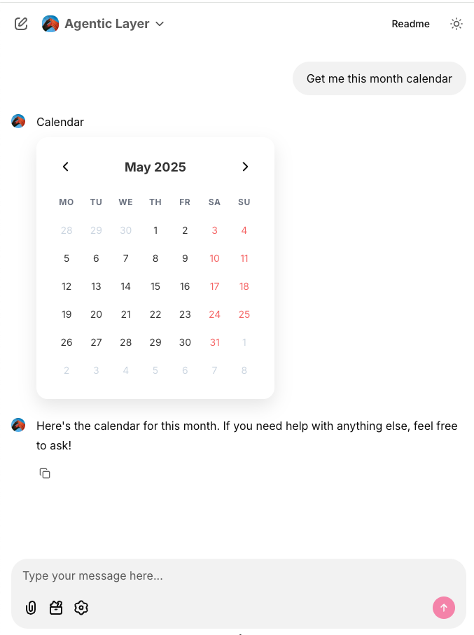

# Software As A Response (SAAR)

React, Flutter etc. introduced component architecture. These are self-contained containers that can present something and take action. This gave HTML elements a kind of superpower. They could now work independently for a feature, while still managing communication and state across components.

Now imagine, instead of these components being part of a big website, they are delivered as responses from an LLM chat. Like, you ask ChatGPT about tax and it gives you a working financial calculator, not just a message.

That’s where the world is going.

This is the new UI of AI.

Read the full article at  [Analogarithm](https://analogarithm.com/software-as-a-response-saar-the-ui-of-ai-57933c454c13) 

This project demonstrates the implementation of custom components in Chainlit with various interactive features including callbacks, actions, and dynamic updates.

## Demo

### Calendar Demo



### Todo List Demo


## Features

- Custom React components integration with Chainlit
- Interactive button components with callbacks
- Dynamic element updates
- Action handling
- User message sending
- Element deletion capabilities

## Component Example

The project includes a sample component (`HelloWorld.jsx`) that demonstrates:

- Button click handling
- Action dispatching
- Dynamic text updates
- User message sending
- Element property updates

```jsx
// Example usage
<Button onClick={() => handleClick('I too')}>{button_text}</Button>
```

## Available Actions

The component demonstrates several Chainlit actions:

1. `callAction`: Triggers custom actions with payload
2. `sendUserMessage`: Sends messages to the chat
3. `updateElement`: Updates component properties dynamically
4. `deleteElement`: Removes the component from the UI

## API Reference

### updateElement
```typescript
updateElement: (nextProps: Record<string, any>) => Promise<{success: boolean}>;
```

### callAction
```typescript
callAction: (action: { name: string, payload: any }) => void;
```

## Getting Started

1. Clone the repository
2. Setup a virtual environment:
   ```bash
   python3.12 -m venv venv
   source venv/bin/activate
   ```
3. Install dependencies:
   ```bash
   pip install -r requirements.txt
   
4. Create a `.env` file and add your OpenAI API key:
   ```bash
   OPENAI_API_KEY=your-openai-api-key
   ```
5. Run the application:
   ```bash
   chainlit run ui.py
   ```

## How it works
open [http://localhost:8000](http://localhost:8000)

Ask for, get me the calendar for this month. 

## Animated Demo

